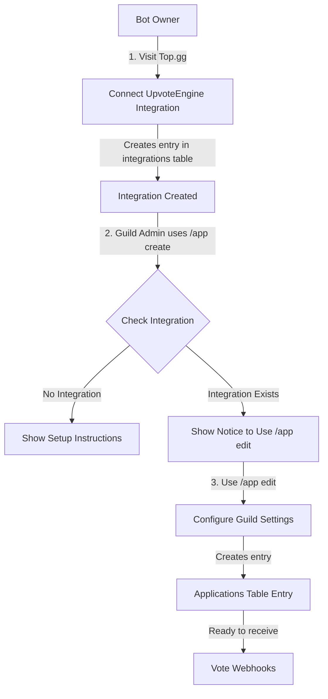
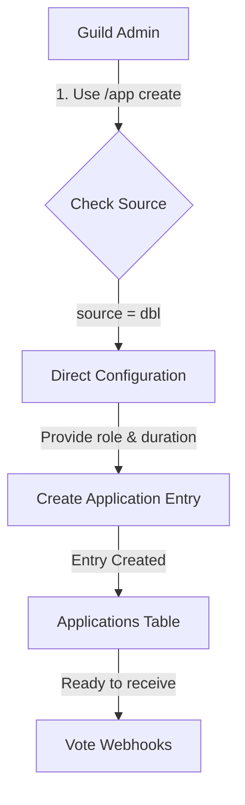

# App Configuration Workflow Documentation

## Overview

The UpvoteEngine system manages bot vote integrations from multiple platforms (Top.gg, Discord Bot List). The workflow differs based on the platform source:

- **Top.gg**: Uses integration-based integration system (requires prior setup on Top.gg)
- **DBL (Discord Bot List)**: Direct configuration without external integration requirements

## Command Structure

The main command is `/app` with the following subcommands:

- `/app create` - Create a new app configuration
- `/app edit` - Edit an existing app configuration
- `/app list` - List all configured apps in the guild
- `/app remove` - Remove an app configuration
- `/app forwarding` - Manage webhook forwarding (set, edit, remove, view)

## Configuration Workflow

### Top.gg Workflow (Integration-Based)

#### Step-by-Step Process

**Step 1: Bot Owner Integration Setup (External)**

- Bot owner visits `https://top.gg/bot/{bot_id}/dashboard/integrations`
- Clicks "Connect" on UpvoteEngine integration
- This creates creates the integration entry in the database.

**Guild Configuration Attempt**

- Guild admin tries `/app create` with source "topgg"
- System checks if integration exists:
  - **If NO**: Display message with setup instructions and link to Top.gg integrations page
  - **If YES**: Display message to use `/app edit` instead

**Step 2: Configure Guild Settings**

- Guild admin uses `/app edit` with:
  - `bot`: The bot user
  - `source`: "topgg"
  - `role`: Role to assign on vote (optional)
  - `duration`: Duration in hours for role (optional)

**Step 3: Authorization Check**

- System verifies user is authorized by checking if they are:
  - The integration creator (from `integrations.userId`)
  - A verified bot owner (from `verifications` table)
  - The service owner (environment variable `OWNER_ID`)

**Step 4: Application Entry Creation/Update**

- Creates or updates entry in `applications` table:
  - `applicationId`: Bot's Discord ID
  - `source`: "topgg"
  - `guildId`: Discord guild ID
  - `voteRoleId`: Role to assign on vote
  - `roleDurationSeconds`: How long the role lasts
  - `secret`: NULL (stored in integrations table instead)
  - `createdAt`: Timestamp

---

### DBL Workflow (Direct Configuration)

#### Step-by-Step Process

**Step 1: Direct Creation**

- Guild admin uses `/app create` with:
  - `bot`: The bot user
  - `source`: "dbl"
  - `role`: Role to assign on vote (required)
  - `duration`: Duration in hours for role (optional)

**Step 2: Validation**

- System validates:
  - Selected user is a bot
  - Bot is not blacklisted
  - Configuration doesn't already exist
  - Guild hasn't reached max apps limit (25)

**Step 3: Application Entry Creation**

- Creates entry directly in `applications` table with all settings

## Data Tables

### `integrations` Table

Stores Top.gg OAuth integration connections (created externally via Top.gg dashboard).

| Field         | Type      | Description                            |
| ------------- | --------- | -------------------------------------- |
| id            | text (PK) | Unique integration ID                  |
| type          | text      | Platform type (currently only "topgg") |
| applicationId | text      | Bot's Discord application ID           |
| secret        | text      | Webhook verification secret            |
| userId        | text      | Discord ID who created the integration |
| createdAt     | text      | ISO timestamp                          |

### `applications` Table

Stores guild-specific bot configurations for receiving votes.

| Field               | Type      | Description                                     |
| ------------------- | --------- | ----------------------------------------------- |
| applicationId       | text (PK) | Bot's Discord application ID                    |
| source              | text (PK) | Platform source ("topgg" or "dbl")              |
| secret              | text      | Legacy field (NULL for new Top.gg integrations) |
| guildId             | text      | Discord guild ID (NULL until configured)        |
| voteRoleId          | text      | Role ID to assign on vote                       |
| roleDurationSeconds | integer   | How long role persists                          |
| invalidRequests     | integer   | Counter for failed webhook attempts             |
| createdAt           | text      | ISO timestamp                                   |

**Note**: Composite primary key on (applicationId, source)

### `votes` Table

Records individual vote events.

| Field         | Type        | Description                     |
| ------------- | ----------- | ------------------------------- |
| id            | bigint (PK) | Snowflake ID from platform      |
| applicationId | text        | Bot that received the vote      |
| source        | text        | Platform source                 |
| guildId       | text        | Guild where vote occurred       |
| userId        | text        | Discord user who voted          |
| roleId        | text        | Role that was assigned          |
| hasRole       | boolean     | Whether user currently has role |
| expiresAt     | text        | When role assignment expires    |

### `verifications` Table

Tracks bot ownership verification for authorization.

| Field         | Type         | Description                    |
| ------------- | ------------ | ------------------------------ |
| id            | integer (PK) | Auto-increment ID              |
| applicationId | text         | Bot's application ID           |
| guildId       | text         | Guild ID                       |
| userId        | text         | User claiming ownership        |
| createdAt     | text         | When verification started      |
| verified      | boolean      | Whether verification succeeded |

## Authorization Rules

### For Top.gg Apps

A user can configure a Top.gg app if they are:

1. **Integration Creator**: The user who originally connected the integration on Top.gg
2. **Verified Owner**: User has completed ownership verification via `/verify-app-ownership`
3. **Service Owner**: User's Discord ID matches `OWNER_ID` environment variable

### For DBL Apps

Any guild admin (with "Manage Server" permission) can configure DBL apps directly.

## Edit vs Create

### `/app create`

- **Top.gg**: Shows instructional messages only
  - No integration → Setup instructions
  - Integration exists → Use `/app edit` notice
- **DBL**: Creates new configuration directly

### `/app edit`

- **Top.gg**: Full configuration (role, duration)
- **DBL**: Updates existing configuration
- Both sources: Requires existing application entry

## Webhook Forwarding

Optional feature to forward vote webhooks to external URLs.

### Commands

- `/app forwarding set` - Create new forwarding configuration
- `/app forwarding edit` - Update URL or secret
- `/app forwarding remove` - Delete forwarding
- `/app forwarding view` - Show current configuration

### `forwardings` Table

| Field         | Type | Description                         |
| ------------- | ---- | ----------------------------------- |
| applicationId | text | Bot's application ID                |
| targetUrl     | text | External webhook URL                |
| secret        | text | Authorization secret for forwarding |

### Forwarding Process

1. When vote webhook received from platform
2. Vote processed normally (role assignment, etc.)
3. If forwarding configured for application:
   - Constructs forwarding payload
   - Sends POST request to `targetUrl`
   - Includes `Authorization` header with secret
   - JSON body with vote details

### Validation

The system validates forwarding URLs to prevent security issues:

- Must be valid URL format
- Cannot be localhost or loopback IPs (127.0.0.1, ::1)
- Cannot be the service's own domain
- Cannot be private IP addresses
- Must use valid hostname pattern

## Limits and Constraints

- **Max Apps per Guild**: 25 configurations
- **Role Duration**: 1-336 hours (1 hour to 14 days)
- **Blacklist**: Bots on blacklist cannot be configured
- **Bot Validation**: Only bot users can be configured (not regular users)

## Error Handling

### Invalid Requests Counter

Each application configuration tracks `invalidRequests`:

- Increments when webhooks arrive but guild/role not configured
- Used to detect misconfiguration and prevent abuse
- Can trigger automatic disabling after threshold

## Testing

Platforms with test support (Top.gg) include test notices in configuration confirmations:

- Shows instructions for sending test votes
- Helps verify webhook connectivity

## Removal

When removing a configuration via `/app remove`:

- Shows confirmation modal with bot and source selection
- Warns about cascading deletion
- Removes:
  - Application configuration entry
  - All associated votes
  - All associated forwardings

## Terminology

- **App/Application**: A bot configuration for receiving votes
- **Integration**: The Top.gg OAuth connection created by bot owner
- **Source**: The platform (topgg or dbl)
- **Configuration**: Guild-specific settings (role, duration)
- **Forwarding**: Optional external webhook relay
